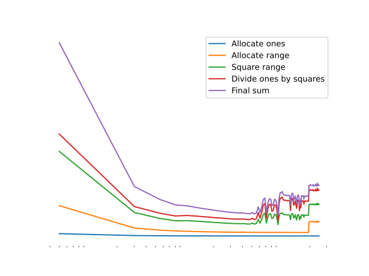

My [previous post](/blog/first/) (which was honestly created to test out the theme
for this site), provided a few code snippets that computed $N$ terms of the
sum of inverse squares. I wrote the code in my 4 favorite languages—Python, C, Rust, 
and Haskell—but when I ran the Python code, it was embarrassingly slow. Compared
to the $\approx 950$ ms it took sequential Rust, Python took 70 seconds! So, in this post,
we're going to attempt to get Python some more reasonable numbers.

## The Original Solution

```python
def basel(N: int) -> float:
    return sum(x**(-2) for x in range(1,N))
```

This is the most *Pythonic* way to do the task. An easy-to-read, single 
line of code that uses built-in generators. Let's time it, with $N=10^8$ 
instead of $10^9$ like the last post (since I don't want to wait that long):

```python
import time

# Time the input function
def time_function(func):
    def wrapper(*args, **kwargs):
        start_time = time.perf_counter()
        result = func(*args, **kwargs)
        end_time = time.perf_counter()
        execution_time = end_time - start_time
        print(f"Function '{func.__name__}' executed in {execution_time:.6f} seconds.")
        return result
    return wrapper
```

```python
>>> f = time_function(basel)
>>> f(100000000) # 10^8
Function 'basel' executed in 6.641589 seconds.
1.644934057834575
```

Let's try rewriting it, but less *Pythonic*, using a `for` loop:

```python
def basel_less_pythonic(N: int) -> float:
    s = 0.0
    for x in range(1, N):
        s += x**(-2)
    return s
```

```python
>>> f(100000000) # 10^8
Function 'basel_less_pythonic' executed in 5.908466 seconds.
1.644934057834575
```

Interesting. The less idiomatic way to write it actually improved performance.
Why? Let's investigate using `dis`, the Python disassembly module.

Here's the original version. I've added some helpful comments:

```armasm
# Load variables
00 LOAD_GLOBAL              0 (sum)
02 LOAD_CONST               1 (<code object <genexpr> at 0x104f42e40>)
04 LOAD_CONST               2 ('basel.<locals>.<genexpr>')

# Create the function
06 MAKE_FUNCTION            0

# Create `range` object
08 LOAD_GLOBAL              1 (range)
10 LOAD_CONST               3 (1)
12 LOAD_FAST                0 (N)
14 CALL_FUNCTION            2

# Convert to iterator
16 GET_ITER

# Call generator
18 CALL_FUNCTION            1

# Call sum function
20 CALL_FUNCTION            1

# Return
22 RETURN_VALUE

f <code object <genexpr> at 0x104f42e40>:
# Essentially a `for` loop with yield
00 GEN_START                0
02 LOAD_FAST                0 (.0)
04 FOR_ITER                 7 (to 20)
06 STORE_FAST               1 (x)
08 LOAD_FAST                1 (x)
10 LOAD_CONST               0 (-2)
12 BINARY_POWER
14 YIELD_VALUE
16 POP_TOP
18 JUMP_ABSOLUTE            2 (to 4)
20 LOAD_CONST               1 (None)
22 RETURN_VALUE
```

Here's the `for` loop version:

```armasm
# Load variables
00 LOAD_CONST               1 (0.0)
02 STORE_FAST               1 (s)

# Create `range` object
04 LOAD_GLOBAL              0 (range)
06 LOAD_CONST               2 (1)
08 LOAD_FAST                0 (N)
10 CALL_FUNCTION            2
12 GET_ITER

# Declare `for` loop
14 FOR_ITER                 8 (to 32)
16 STORE_FAST               2 (x)

# Power, add, store
18 LOAD_FAST                1 (s)
20 LOAD_FAST                2 (x)
22 LOAD_CONST               3 (-2)
24 BINARY_POWER
26 INPLACE_ADD
28 STORE_FAST               1 (s)

# Go to top of `for` loop
30 JUMP_ABSOLUTE            7 (to 14)

# return `s`
32 LOAD_FAST                1 (s)
34 RETURN_VALUE
```

In this *specific case*, using the generator slowed down the program.
As we can see, the generator loop code is identical to the second version.
The first one just does extra work dealing with the generator object,
which requires (slow) `CALL_FUNCTION` directives. Note that in practice, generators
are usually faster due to their lazy nature. It's just that in this case,
the extra bloat isn't worth it.

Regardless, the difference in performance between the two versions ($\approx 1$s)
is insignificant compared to the overall difference between Python and C/Rust.
Even with the faster version, the Rust code is $\approx 65$ times faster than Python. 

Why? Mainly because Python is a loosely typed, interpreted language.
This means that the Python interpreter (CPython), has to translate
Python code into something easily executable by your computer, on-the-fly.
It does this by quickly compiling Python code into a generalized form
of assembly, called Python bytecode, which we just looked at.

This is then executed by the interpreter. This compilation step
is the first hit to performance that Python suffers. Since languages
like Rust only require a program to be compiled once, that time isn't
factored into a programs *runtime*. But the biggest hit to performance
comes from having poor quality, architecture agnostic as opposed to natively
optimized bytecode. This is simply
a part of the nature of interpreted languages, since they can't afford to spend
so much time on high quality compilation.

So, how *can* you write fast Python? Well, you can't. But, you *can* call
into fast C code, through heavily optimized libraries like Numpy. These libraries
contain pre-compiled, vectorized C functions that let you bypass the whole
Python interpreter.

## Let's Use Numpy

```python
import numpy as np

def basel_np(N: int) -> float:
    # [1, 1, ..., 1] 
    ones = np.ones(N - 1)
    # [1, 2, ..., N]
    r = np.arange(1, N)
    # [1, 1/2, ..., 1/N]
    div = ones / r
    # [1, 1/4, ..., 1/N^2]
    inv_squares = np.square(div)
    # ~ pi^2/6
    return float(np.sum(inv_squares))
```

```python
>>> f(100000000) # 10^8
Function 'basel_np' executed in 0.460317 seconds.
1.6449340568482196
```

Wow, that ran $\approx 13$ times faster! Looking at the bytecode in
this case won't tell us much, since it'll just consist of a few 
`CALL_FUNCTION`s to numpy, which does the actual work. Let's see which
line is taking the largest toll:

```python
def basel_np(N: int) -> tuple[float, list[float]]:
    times = []

    # Time a single step
    start = time.perf_counter()
    ones = np.ones(N - 1)
    end = time.perf_counter()
    step_time = end - start
    times.append(step_time)

    # Remaining timing code omitted
    r = np.arange(1, N)
    div = ones / r
    square = np.square(div)
    ret = np.sum(square)

    return ret, times
```

| Operation               | Time for operation  (ms)   | Cumulative Time (ms)  |
| ----------------------- | -------------------------- | --------------------- |
| Creating ones           | 97                         | 97                    |
| Creating range          | 79                         | 176                   |
| Squaring range          | 98                         | 274                   |
| Dividing ones/squares   | 112                        | 387                   |
| Final sum               | 58                         | 444                   |

Let's think about these numbers for a minute. The *creating ones/range* steps
don't involve heavy computational work. However, they take almost the same
amount of time as the "tougher" steps, such as squaring and dividing. Surprisingly,
the sum over the final array is the fastest step! This suggests that the bottleneck
here is not the CPU, but memory access. Let's see how performance scales, 
ranging $N$ from $10^7$ to $10^9$.


> In this plot, the edge of the topmost line represents the total time taken,
> and the space in between consecutive lines represents the time for each step.

We can see that

1. The total time increases non-linearly, even though the algorithm is $O(n)$

2. The `divide` step takes the most amount of time, with sharp increases
at $\approx 3 \times 10^8$ and $\approx 7 \times 10^8$.

This makes sense, because unlike the other operations, `np.divide` needs to 
access two large arrays simultaneously, and write the result to a new array.
This means lots of main memory accesses, and possibly reads from the SSD, which
is extremely slow.

### Broadcasting

There's actually an optimization for these kinds of problems that Numpy has
built-in called [broadcasting](https://numpy.org/doc/stable/user/basics.broadcasting.html),
which virtually "projects" smaller sized vectors into larger sizes for vector-vector
operations.


```python
def basel_np_broadcast(N) -> float:
    ones = 1
    r = np.arange(1, N)
    div = ones / r
    square = np.square(div)
    # As if its [1, 1, ..., 1] / [1, 4, ..., N^2]
    return float(np.sum(square))
```

This lets us save a lot of precious cache space. Let's run the same metrics as before.
With $N=10^8$:


| Operation               | Time for operation  (ms)   | Cumulative Time (ms)  |
| ----------------------- | -------------------------- | --------------------- |
| Creating ones           | 0.00                       | 0                     |
| Creating range          | 68.56                      | 70.48                 |
| Squaring range          | 105.14                     | 180.74                |
| Dividing ones/squares   | 133.08                     | 271.30                |
| Final sum               | 71.08                      | 310.41                |


> From now on, I'll refer to the broadcasted version as "the Numpy solution".

Although a significant improvement, we still see those latency spikes.
Let's try to fix that.

## Thinking About Memory

To improve the memory use of the function, we could
work block-by-block, doing the same operations on small chunks
of the range at a time, and adding it all up in the end. This
would let us only keep one chunk in memory at once, and hopefully
lead to better cache utilization while still benefiting from 
Numpy's vectorized code.

Lets modify the function to take a range of $N$s:

```python
# [N1, N2], inclusive
def basel_np_range(N1: int, N2: int) -> float:
    # Timing code omitted
    ones = 1
    r = np.arange(N1, N2 + 1)
    div = ones / r
    squares = np.square(div)
    return float(np.sum(squares))
```

And write a function to sum up all the chunks.

```python
def basel_chunks(N: int, chunk_size: int) -> float:
    # Timing code omitted
    s = 0.0
    num_chunks = N // chunk_size
    for i in range(num_chunks):
        s += basel_np_range(i * chunk_size + 1, (i + 1) * chunk_size)
    return s
```

With $N=10^8$:

```
Function 'basel_chunks' executed in 0.108557 seconds.
1.6449340568482258
```

Nice! It runs $\approx 3$ times faster than the Numpy solution. 

As a plus, the answer will actually 
be slightly *more accurate*, due to the nature of *IEEE 754* floats.
Let's look at how the performance scales in the same way we did before,
keeping the chunk size constant.


First of all, look at the y-axis. We're now working on the scale
of seconds, not minutes. We also see that the runtime
increases linearly, consistent with the algorithm's $O(n)$ time complexity.
We can theorize that with the `chunk_size` of 20000, all of the information
is able to be fit in cache, so there are no runtime spikes for out-of-cache
access.

Let's try varying `chunk_size` in the range $[5 \times 10^2, 10^6]$, keeping $N$ constant at $10^9$.



From the figure, we see performance gains up until a $\approx 51000$ `chunk_size`,
after which there are latency spikes presumably caused by cache misses.

## Some Napkin Math


Each `float64`, uses 64 bits, or 8 bytes. We are working with 3 arrays
of $N$ `float64`s, so memory usage for one call is 
$51000 \times 8 \times 3 = 1224000 \approx 1.2 $ MB.

My M1 Pro has the following specs:

| Memory Type | Size                                      |
| ------      | ------                                    |
| L1          | 128KB (data cache, per core)              |
| L2          | 24MB (shared between 6 performance cores) |
| L3          | 24MB                                      |
| Main        | 16GB                                      |

This suggests the maximum $L1 + L2$
cache space available to the function is $\approx 1.2$ MB, and if we go over that, we 
have to wait for the $L3$ cache.

## Multiprocessing

Now, let's try making the computer fit more of the array into cache.
One possibility is to try running the function on all of the cores,
so that we can use more $L2$ for our function, so let's try that.

First, let's modify `basel_chunks` to take a range of $N$s as input.

```python
# (N1, N2]
def basel_chunks_range(N1: int, N2: int, chunk_size: int):
    # Timing code omitted
    s = 0.0
    num_chunks = (N2 - N1) // chunk_size
    for i in range(num_chunks):
        s += basel_np_range(N1 + i * chunk_size + 1, N1 + (i + 1) * chunk_size)
    return s
```

Now for the actual multiprocessing:

```python
from multiprocessing import Pool

def basel_multicore(N: int, chunk_size: int):
    # 10 cores on my machine
    NUM_CORES = 10 
    N_PER_CORE = N // NUM_CORES
    Ns = [
        (i * N_PER_CORE, (i + 1) * N_PER_CORE, chunk_size)
        for i in range(NUM_CORES)
    ]
    # process 10 batches in parallel
    with Pool(NUM_CORES) as p:
        result = p.starmap(basel_chunks_range, Ns)
    return sum(result)
```

Under the hood, Python's [multiprocessing](https://docs.python.org/3/library/multiprocessing.html) 
module [pickles](https://docs.python.org/3/library/pickle.html)
the function object, and spawns 9 new instances of `python3.10`, all of which
execute the function with $N=10^9$ and `num_chunks = 50000`.

Let's compare performance.

```
Function 'basel_multicore' executed in 1.156558 seconds.
1.6449340658482263
Function 'basel_chunks' executed in 1.027350 seconds.
1.6449340658482263
```

Oops, it did worse. This is probably because initial work done by
multiprocessing is expensive, so it will only be of benefit
if the function takes a relatively long time to complete.

Increasing $N$ to $10^{10}$:

```
Function 'basel_multicore' executed in 2.314828 seconds.
1.6449340667482235
Function 'basel_chunks' executed in 10.221904 seconds.
1.6449340667482235
```

There we go! It's $\approx 5$ times faster. Let's try $10^{11}$

```
Function 'basel_multicore' executed in 13.844876 seconds.
multicore 1.6449340668379773
Function 'basel_chunks' executed in 102.480372 seconds.
chunks 1.6449340668379773
```

That's $\approx 8$ times faster! As $N$ increases, the ratio
of single-core to 10-core should approach 10:1. 


> The x-axis is on a log scale, which is why the linearly increasing runtimes look
> exponential

We can see that using multiprocessing has a $\approx 1$ second overhead,
so there's only a performance benefit when the chunked runtime is higher. 
This happens at $\approx N=1.3 \times 10^9$. After that, however,
there is a massive difference.

Through experiment
(not shown here) I found that a `chunk_size` around 50000 is also
optimal for the multiprocessing code, telling us that the OS
puts some restriction on L2 use for a single core.


## Summary of Results

| Python function        | $N=10^8$    (s)           | $N=10^9$ (s) | $N=10^{10}$ (s)                 |
| ---------------------- | ------------------------- | -------      | ------------------------------- |
| `basel_multicore`      | 1.04                      | 1.17         | 2.33                            |
| `basel_chunks`         | 0.09                      | 0.91         | 9.18                            |
| `basel_np_broadcast`   | 0.27                      | 9.68         | NaN (Ran out of memory)         |
| `basel_less_pythonic`  | 5.99                      | 59.25        | 592 (est.)                      |
| `basel` (idiomatic)    | 7.64                      | 68.28        | 682 (est.)                      |
| `basel_np`             | 0.618                     | 44.27        | NaN (Ran out of memory)         |

How does it stack up to the languages from the last post?

| Language              | $N=10^9$ (ms) |
| ------------------    | ----------    |
| Rust (multicore)      | 112.65        |
| `basel_chunks`        | **913**       |
| Rust (--release)      | 937.94        |
| C  (-O3)              | 995.38        |
| `basel_multicore`     | 1170          |
| `basel_np_broadcast`  | 9680          |
| Haskell (-O3)         | 13454         |
| `basel_np`            | 44270         |
| `basel_less_pythonic` | 59250         |
| `basel` (idiomatic)   | 68280         |

Extremely good!  The chunked Numpy code is the fastest sequential solution! And remember,
Python has a whole interpreter running in the background as it makes 
calculations.

Comparing Rust to Python multicore:

| Language   | $N=10^8$ (ms) | $N=10^9$ (ms) | $N=10^{10}$ (ms) | $N=10^{11}$ (ms) |
| ---------- | ----------    | ----------    | -------------    | -----------      |
| Rust       | 12.3          | 111.2         | 1083             | 10970            |
| Python     | 1040          | 1173          | 2330             | 12629            |

Clearly, Rust's method of parallelization (through OS threads) is far more
efficient for small $N$ than Python's process based parallelism. But the difference
between two shrinks as $N$ increases.

## Conclusion

If it wasn't clear, this entire article was just an exercise to learn
a bit about how python works under the hood. *Please do not try
to impress your manager by hyper-optimizing your Python*. There's
almost always a better solution, like

```python
from math import pi

def basel_smart() -> float:
    return pi*pi / 6
```

Ta-da! Orders faster and infinitely simpler than all the other functions.

When thinking about performance, you need to be careful. Don't *assume* 
performance is an issue until you measure, and you *know* it is. If so,
always see if there's a smarter way of solving the problem before
you rush to type `import multiprocessing` and brute force your way through
an otherwise simple problem.

Also, if your application is really that performance critical, you probably 
shouldn't be writing it in Python. Python was created as a tool that excels 
in prototyping, not execution speed. But as you can see, it isn't *impossible*
to get awesome performance. 

Anyway, I hope you enjoyed my first real article on this site. If you find
a faster Python "solution" to this "problem", shoot me an email!

## Update log

| Date         | Description                                      | Thanks to                                                                                              |
| ------------ | ------------------------------------------------ | ------------------------------------------------------------------------------------------------------ |
| 08/02/2023   | Added the broadcasting section, Python becomes fastest solution                   | [u/mcmcmcmcmcmcmcmcmc_](https://tinyurl.com/2s4xs66z) & [u/Allanon001](https://tinyurl.com/3mvch78v)   |
| 08/02/2023   | Changed `time.time()` to `time.perf_counter()`   | [u/james_pic](https://tinyurl.com/2ezytap3)                                                            |
