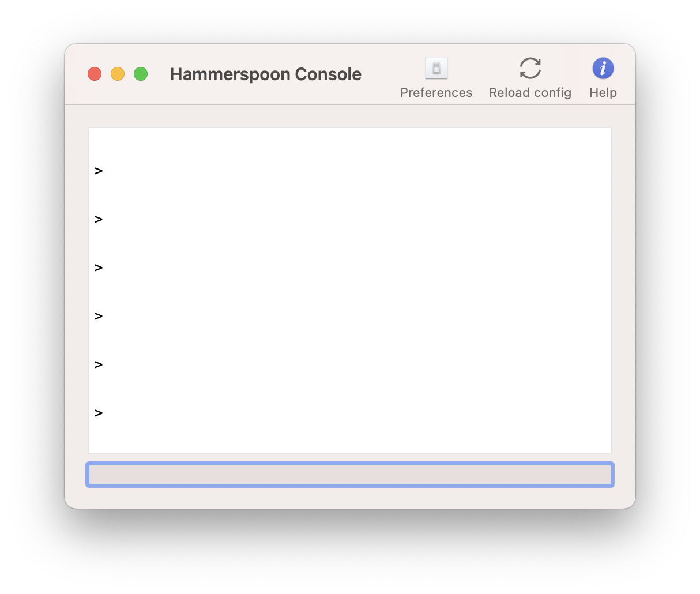
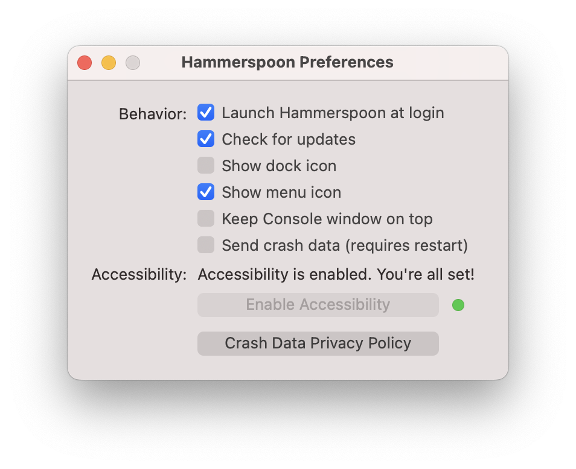

If you're a nerd, and you've been around Macs for a while, you might remember Applescript. It was a language developed by Apple to allow intermediate–to–advanced users to write simple scripts that could control Mac applications. It was actually created to resemble the English language, so accessing a pixel would be written as

```applescript
pixel 7 of row 3 of TIFF image "my bitmap"
```

or even

```applescript
TIFF image "my bitmap"'s 3rd row's 7th pixel
```

Needless to say, there's a good reason modern programming languages don't look like this: it doesn't scale. Anyone who has worked with Applescript for extended periods of times knows how fast you run into limitations. Apple unofficially deprecated it in 2016, when Sal Soghoian, the creator, was let go for ["business reasons"](https://9to5mac.com/2016/11/17/mac-user-automation-sal-soghoian/).

As Applescript was declining, a wise man named [Steven was writing Hammerspoon](https://github.com/Hammerspoon/hammerspoon/commit/9592cbce6ad139871bedfb2822c8b8194555c380), a Lua bridge to the macOS API. Lua, as a simple and modern programming language, was a perfect fit. So, let's see how we can use it.

## Installing Hammerspoon

Use [Homebrew](https://brew.sh).

```
brew install hammerspoon
```

## Setup

Create a file called  `~/.hammerspoon/init.lua`.

```bash
mkdir ~/.hammerspoon && touch ~/.hammerspoon/init.lua
```

Open the App.

```bash
open -a Hammerspoon
```

You should see a Lua console like this (don't worry about the text inside).



Click Preferences, and make sure accessibility is enabled.



If you'd like, you can also check `Launch Hammerspoon at Login`.

## Making sure init.lua is working

Paste the following in the `init.lua` you created.

```lua
local logger = hs.logger.new("init.lua", "debug")
logger.d("SUCCESSFULLY RAN init.lua")
```

Save the file, and hit the `Reload` button in the console. If you see the output, you're good to go.
## Binding System-wide hotkeys

The main thing I use Hammerspoon for is creating "smart" hotkeys, without messing with the buggy ones in Preferences or downloading another app like Karabiner. Here are some starter functions that you can put in `init.lua` to make creating new hotkeys extremely simple.

```lua
local function stringsplit(inputstr, sep)
	if sep == nil then
		sep = "%s"
	end
	local t = {}
	for str in string.gmatch(inputstr, "([^" .. sep .. "]+)") do
		table.insert(t, str)
	end
	return t
end

local function keyMapArray(global_modifiers, mappings)
	for k, v in pairs(mappings) do
		if type(v) == "string" then
			-- The modifiers that we are mapping to
			local modifiers = {}
			local splitkey = stringsplit(v, "-")

			local splitlen = #splitkey
			-- Append any mapped modifiers contained in v
			-- to the modifier array
			for i = 1, splitlen - 1 do
				modifiers[i] = splitkey[i]
			end

			-- This gets the number keycode to pass to the bind function
			local mappedKeyCode = hs.keycodes.map[splitkey[splitlen]]
			if mappedKeyCode then
				hs.hotkey.bind(global_modifiers, k, function()
					hs.eventtap.keyStroke(modifiers, mappedKeyCode, 1)
				end)
			else
				-- The number keycode was nil, which means it doesn't exist
				-- Now we try treating it as a system key event code such as
				-- PLAY
				hs.hotkey.bind(global_modifiers, k, function()
					hs.eventtap.event.newSystemKeyEvent(v, true):post()
					hs.eventtap.event.newSystemKeyEvent(v, false):post()
				end)
			end
		elseif type(v) == "function" then
			hs.hotkey.bind(global_modifiers, k, v)
		end
	end
end

local function processMaps(maps)
	for globals, mappings in pairs(maps) do
		keyMapArray(globals, mappings)
	end
end

```

If you're not familiar with Lua and feel intimidated, don't worry. The point of this function is to get you started without having to learn Lua. Let's look at how to create a new mapping. Let's say you want Vim arrow key bindings system-wide, activated by `ctrl`. 

```lua
-- Define mappings
local maps = {
	[{ "ctrl" }] = {
		-- Arrow keys
		["h"] = "left",
		["j"] = "down",
		["k"] = "up",
		["l"] = "right",
	},
}

-- Bind the mappings
processMaps(maps)
```

Just put that at the bottom of the file, reload config, and your keys should be mapped!

### How `maps` works

`maps` is an array, or list of tables. Each table has an array of modifier keys as its key, and a table that maps one key to another key as the value. In the above example, the only modifier key is `ctrl` meaning all of the mappings in its table are only activated when `ctrl`  is held down. Then it maps `h` to left arrow, `j` to down arrow, etc.

If you still don't get it, don't worry. Just look at these examples and modify them to fit your needs.

### Examples

Here's some more examples of `maps tables`:

Map `ctrl-n` to delete word, `ctrl-m` to delete character, `ctrl-.` to delete word in front of cursor, and `ctrl-,` to delete character in front of cursor.

```lua
-- inside `maps`
[{ "ctrl" }] = {
	-- Deleting
	["n"] = "alt-delete",
	["m"] = "delete",
	[","] = "forwarddelete",
	["."] = "alt-forwarddelete",
},
```

Map function keys to media controls. Notice that these don't have any modifer keys, so just pressing `f1` will activate the binding:

```lua
-- inside `maps`
[{}] = {
	-- Media controls
	["f1"] = "MUTE",
	["f2"] = "SOUND_DOWN",
	["f3"] = "SOUND_UP",

	["f5"] = "PREVIOUS",
	["f6"] = "PLAY",
	["f7"] = "NEXT",
},
```

Reload your Hammerspoon config with `alt-ctrl-r`

```lua
-- inside `maps`
[{ "alt", "ctrl" }] = {
	-- Reload Hammerspoon config
	["r"] = hs.reload,
},
```

Set your laptop to sleep with `cmd-g`

```lua
-- inside `maps`
[{ "cmd" }] = {
	["g"] = function()
		-- This function executes a shell command
		os.execute("pmset sleepnow")
	end,
},
```

Launch the [Obsidian](https://obsidian.md) app with `cmd-shift-o`

```lua
[{ "cmd", "shift" }] = {
	["o"] = function()
		hs.application.launchOrFocus("Obsidian")
	end,
},
```

Remember to run `processMaps(maps)` after you define everything!

```lua
local maps = {
	[{}] = {
		-- stuff
	},
	[{ "cmd" }] = {
		-- stuff
	},
	[{ "cmd", "shift" }] = {
		-- stuff
	},
	-- ...
}

processMaps(maps)
```

## Conclusion

Hammerspoon is an extremely powerful tool. Once you familiarize yourself with Lua, the possibilities are endless. I just focused on hotkeys in this post as it's what I've found to be biggest use case for Hammerspoon.

If you want to see all the API functions that Hammerspoon exposes, check out their [documentation](https://www.Hammerspoon.org/docs/index.html). There's an absurd amount of things you can do with this app—like [binding events to the battery status](https://www.hammerspoon.org/docs/hs.battery.watcher.html), [changing display brightness](https://www.hammerspoon.org/docs/hs.brightness.html), [opening dialogue prompts](https://www.hammerspoon.org/docs/hs.dialog.html), [sending http requests](https://www.hammerspoon.org/docs/hs.http.html), [copying and pasting](https://www.hammerspoon.org/docs/hs.pasteboard.html), et cetera. On top of that, you can take advantage of the entire Lua ecosystem through [Luarocks](https://luarocks.org).

Also, checkout [r/Hammerspoon](https://www.reddit.com/r/Hammerspoon/) to see what other enthusiasts are up to. We could use some more members there :)

## Useful links

A collection of resources related to Hammerspoon. I'll keep this updated as I run into new things.

| Site | Description |
| --- | ------------ |
|[Documentation](https://www.Hammerspoon.org/docs/index.html) | The complete Hammerspoon API documentation |
| [r/Hammerspoon](https://www.reddit.com/r/Hammerspoon/) | Subreddit with various Spoons and showcases |
| [Spoons](http://www.Hammerspoon.org/Spoons/) | A list of Spoons, which are plugins for Hammerspoon. |
| [ControlEscape.spoon](https://github.com/jasonrudolph/ControlEscape.spoon) | Map your control key to ESC when tapped, and ctrl when held. Useful for Vim users |


