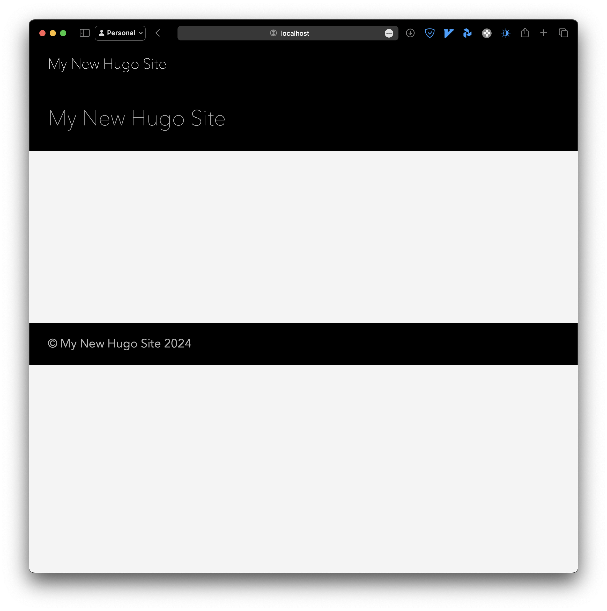

We're going to go through a minimal example that will let you run Rust code on
the client side of a Hugo site. We are going to compile the Rust code into WebAssembly
(wasm), which will give us near-native performance on the browser!

<!--more-->

## Creating a new Hugo site

First let's initialize Hugo's quickstart site:

```bash
hugo new site quickstart_wasm
cd quickstart_wasm
git init
git submodule add https://github.com/theNewDynamic/gohugo-theme-ananke.git themes/ananke
echo "theme = 'ananke'" >> hugo.toml
hugo server
```

You should see something like:

```bash
# Logs ...
Built in 28 ms
Environment: "development"
Serving pages from disk
Running in Fast Render Mode. For full rebuilds on change: hugo server --disableFastRender
Web Server is available at http://localhost:55802/ (bind address 127.0.0.1)
```

If you open up the `localhost` url, you should see something like this:



## Creating a Rust project  

We're going to use Rust as the source language for our wasm, primarily because
its macros make it extremely easy to create bindings. For convenience,
let's initialize the library within the `assets` directory in our Hugo site.

```bash
# In hugo site folder
cd assets
mkdir rust_app && cd rust_app
cargo init --lib
```

Open `Cargo.toml` and add the following

```toml
# Add this at the bottom
[lib]
crate-type = ["cdylib", "rlib"]
```

Now, we need to add `wasm-bindgen` as a dependency, which will give us a single-line solution
to create bindings.

```bash
cargo add wasm-bindgen
```

In `src/lib.rs`, let's write a performance critical function that we need to
call from our web app

```rust
use wasm_bindgen::prelude::*;

#[wasm_bindgen]
pub fn sieve_of_eratosthenes(n: usize) -> Vec<i32> {
    let mut primes = Vec::new();
    let mut is_prime = vec![true; n + 1];
    is_prime[0] = false;
    is_prime[1] = false;

    for i in 2..=n {
        if is_prime[i] {
            primes.push(i as i32);

            let mut j = 2 * i;
            while j <= n {
                is_prime[j] = false;
                j += i;
            }
        }
    }

    primes
}
```

We will build this with

```bash
wasm-pack build --target web
```

You should see the compiled output in `pkg`.

```bash
ls pkg
```
```
package.json  rust_app.d.ts  rust_app.js  rust_app_bg.wasm  rust_app_bg.wasm.d.ts
```


## Calling Rust from Javascript

Now, in the `rust_app` folder, let's create a web app
that will use our prime sieve.

```bash
# in assets/rust_app
mkdir www && cd www
touch index.js
```

Put the following in the index.js file

```javascript
import init, * as wasm from '../pkg/rust_app';

init(wasm_path).then(_ => {
    function computePrimes()
    {
        var inputNumber = parseInt(
            document.getElementById('inputNumber').value,
        );
        if (!isNaN(inputNumber) && inputNumber >= 1) {
            var primes = wasm.sieve_of_eratosthenes(inputNumber);
            document.getElementById('output').innerText = primes.join(', ');
        } else {
            document.getElementById('output').innerText =
                'Please enter a valid integer.';
        }
    }
    let button = document.getElementById('computeButton');
    button.addEventListener('click', () => {
        computePrimes();
    });
});
```

## Calling wasm from Hugo

Now, we want the output of the wasm function to show up
on the site. So, let's make a shortcode that we can insert into an article with
a small web app.


In `~/quickstart_wasm/layouts/shortcodes/wasm_app.html`

```html
<!doctype html>
<html lang="en">
  <head>
    <title>Prime Number Finder</title>
  </head>
  <body>
    <input type="number" id="inputNumber" placeholder="Enter an integer..." />
    <button id="computeButton">Compute</button>
    <div id="output"></div>

    <!-- rust_app MUST be in /assets to be detected! -->
    {{ $wasm_path := resources.Get "rust_app/pkg/rust_app_bg.wasm" }}

    <script>
      wasm_path = "{{ $wasm_path.Permalink }}";
    </script>

    {{ $index_js := resources.Get "rust_app/www/index.js" | js.Build }}

    <script type="module" src="{{ $index_js.Permalink }}"></script>
  </body>
</html>
```

The key here is the part where we set the global `wasm_path` variable
in our JS environment. This does two things:

1. Tells Hugo to make that path accessible through `fetch` requests
2. Gives the JS script the wasm bytecode to execute

We should now be able to use the prime number generator from the home page!


## Conclusion

There weren't many resources on wasm + Hugo online, so I figured I'd make the 
first tutorial. If you have an alternative/better method to deploy wasm, 
please let me know in the comments.
