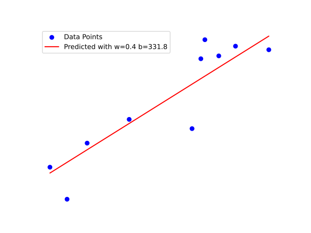

Welcome to my N-part series (N to be determined) on Machine Learning Fundamentals in C. This series will be all about *fundamentals*, which I feel is missing from much of the online resources related to Machine Learning and Neural Networks. 

<!--more-->

When I initially sought out to learn about neural networks, all I found were articles that either

1. Showed a couple lines of Tensorflow code that fetched training data, trained the model, and ran predictions, or
2. Lower-level tutorials that gave implementation details, but left me with more questions than answers

None of them dragged you through the (rather boring) elementary concepts that build up to the *The Neuron*. That is what I aim to do with this series. It will

1. Build up intuition, with a reasonable amount of math
2. Translate it to code, all in C, with *zero libraries* so that none of the implementation details are hidden

## Prerequisite Knowledge

I'm going to assume the following about you

1. You are familiar with C, or a C-like language (C++, Java, C#, etc.)
2. You understand derivatives (e.g. $\frac{d}{dx}$) and partial derivatives (e.g. $\frac{\partial}{\partial x}$)

## Introduction

> So we're beginning with something as mundane as linear regression; what does this have to do with machine learning? How will this help me create the next ChatGPT??

To be cliché, let's ask ChatGPT what it thinks machine learning is:

> What is the most fundamental and minimal definition of the term "Machine learning"?
> 
> Machine learning is a process where computers learn from data to improve their performance on **tasks** *without being explicitly programmed* (emphasis mine).

The **task** that this series will focus on is **prediction**. That is, we want our model to learn how to predict outcomes given some input data. And as we feed it more data, it should, *without explicit programming*, get better at making predictions on data it hasn't seen. 

Let's first define a simple model.

## The Single Variable Linear Model

[Code for part 1](https://github.com/nathom/machine-learning-fundamentals/tree/main/part1)

This model is built for a prediction task that a) has only one input variable, b) has only one output variable, and c) the relationship between the input and output variables is *approximately* linear. It is defined as the following.

$$
\hat{y} = wx + b
$$

And in code:

```c
struct linear_model {
	double w;
	double b;
};

double predict(struct linear_model m, double x) {
	return m.w * x + m.b; // y hat
}
```


As you can see, the model itself is defined by two parameters, $w$ and $b$, which determine the how the predicted output $\hat{y}$ is related to the input $x$. To test out the model, let's fabricate some data. 

```c
// House sizes, in square feet. Our x variable
static double xs[] = {2360, 5272, 4592, 1966, 5926, 4944, 4671, 4419, 1630, 3185};
// Corresponding house prices, in 1000s of dollars. Our y variable
static double ys[] = {1359, 2576, 2418, 655, 2531, 2454, 2657, 1541, 1057, 1657};

```


Now, our task is to predict housing prices based on house size, so we need to find a $w$ and $b$ that defines a "optimal" model. But how do we define "optimal"? It is the *least bad* model or the model with the *smallest error*. But how do we define "error"? One way is 

$$
\text{error} = \text{predicted value} - \text{actual value}
$$
The issue with this is that minimizing the error would make the optimal prediction for our model to be $-\infty$, which is the minimum error, but not what we're looking for. What we want is an error function that is *concave*, which means it has a bounded minimum value that actually reflects good performance.

$$
\text{error} = \left( \text{predicted value} - \text{actual value}  \right)^2
$$

This function's minimum value is $0$, and if $\text{error} \approx 0$ then $\text{predicted value} \approx \text{actual value}$. So minimizing this function would give us the optimal model. From now on, we'll call this the loss function.

```c
double loss(double y_hat, double y) {
	double diff = y_hat - y;
	return diff * diff;
}
```

But we want to minimize the loss across *all* of the data samples we have. So, let's take the average loss over all $m$ samples, and call it the total *error function*, $J_{wb}$. 

$$
J(w, b) =  \frac{1}{m} \sum_{i=0}^{m-1} (\hat{y}^{(i)} - y^{(i)})^2
$$

```c
double error(struct linear_model model, double *xs, double *ys, int m) {
	double sum = 0.0;
	for (int i = 0; i < m; i++) {
		double y_hat = predict(model, xs[i]);
		double _loss = loss(y_hat, ys[i]);
		sum += _loss;
	}
	return sum / ((double) m);
}
```

This gives us a single number that tells us how *bad* the model is. Now we need to get this to zero.

## Minimizing Error

### The Naive Way

A naive approach to do this would be to generate a large number of `linear_model`'s with a range of `w`s and `b`s, and see which one has the smallest `error` for our dataset.

```c
struct linear_model
optimize_brute_force(double *xs, double *ys, int m)
{
    const double min = -1000.0, max = 1000.0;
    const int num_samples = 1e4;
    const double increment = (max - min) / ((double)num_samples);

    double min_error = 1e10;
    struct linear_model curr;
    struct linear_model optimal;
    // Iterate through (w, b) in [min, max] x [min, max]
	// and find pair with lowest error
    for (int i = 0; i < num_samples; i++) {
        curr.w = min + increment * i;
        for (int j = 0; j < num_samples; j++) {
            curr.b = min + increment * j;

            double err = error(curr, xs, ys, m);
            if (err < min_error) {
                min_error = err;
                optimal = curr;
            }
        }
    }
    return optimal;
}
```

Let's run it on our dataset:

```
Brute force optimization model: {w: 0.400000, b: 331.800000}
Error: 88068.508000
```

How well does it predict?



Pretty good! And we know the theoretical optimum is within $\pm \text{increment}$ or $\pm 0.2$  from the given values.

But let's be honest: this is an *extremely* sub-optimal solution. The runtime is $O(n^2)$ with respect to the number of samples, which isn't terrible if we only have two parameters $w$ and $b$. But if we had, lets say 10, it would be $O(n^{10})$. This makes it extremely impractical when we have multiple input variables, which almost every real-world problem has.

### Gradient Descent

So we need to find a smarter way than literally guessing every single number. 

> Warning: calculus (😱) lies ahead 

JK.

Picture this: you have been dropped in a random location in the middle of a hilly area. You were told before that somewhere, there is a valley. And in this valley, there is food and water. And if you don't find the valley, you'll die. Also, there is extremely thick fog so you can only see the 1 foot radius surrounding you. How can you find the valley, if all you know is it is at the lowest point in the area?

Strategy:

1. Look around you on the ground
2. In which direction is there the steepest descent?
3. Move one foot in that direction
4. Go to step 1

As long as the valley exists, this will get you to the bottom. Plot twist: the hilly area is actually called **error hills** and your strategy is called **gradient descent**! Math time.

#### Math

First we need to see the effect changing $b$ a tiny bit has on the error. This is the derivative of the error function with respect to $b$. Solving

$$
J(w, b) =  \frac{1}{m} \sum_{i=0}^{m-1} (\hat{y}^{(i)} - y^{(i)})^2 \\
= \frac{1}{m} \sum_{i=0}^{m-1} (wx^{(i)}+b - y^{(i)})^2
$$
$$
\frac{\partial J}{\partial b} = 2\frac{1}{m} \sum_{i=0}^{m-1} (wx^{(i)} + b - y^{(i)})
$$

We need to change $w$ too, so lets calculate the derivative of error with respect to $w$.

$$
\frac{\partial J}{\partial w} = 2 \frac{1}{m} \sum_{i=0}^{m-1} (wx^{(i)} + b - y^{(i)})x^{(i)}
$$
We're just using the [product](https://en.wikipedia.org/wiki/Product_rule) and 
[chain](https://en.wikipedia.org/wiki/Chain_rule) rules here. So both of these derivatives answer the question: "If I increase the variable a bit, how much does the error increase?". Now, we want the error to *decrease*, so we should be taking the opposite direction.

Algorithm:

1. Set the starting point: $w:=0, b:=0$
2. Move the variables in the opposite direction as the derivatives,
 with step size $\alpha$: $w:= w-\alpha \frac{\partial J}{\partial w}, b:=b-\alpha \frac{\partial J}{\partial b}$
3. Go to step 2.


What will happen eventually is the derivatives will approach 0 when $w,b$ are at their minimum. This is because at a minimum (or bottom of the valley), no matter which direction you go the error won't significantly change.

#### Code

Let's first write a function that calculates the derivatives, which we will package into a struct called `gradient`.

```c
struct gradient {
    double dJ_dw;
    double dJ_db;
};

struct gradient
calculate_gradient(struct linear_model model, double *xs, double *ys, int m)
{
    double dJ_dw = 0.0, dJ_db = 0.0;
    for (int i = 0; i < m; i++) {
        double y_hat = predict(model, xs[i]);
        double diff = y_hat - ys[i];
        dJ_db += diff;
        dJ_dw += diff * xs[i];
    }
    // We're going push that factor of 2 into alpha to save a multiplication
    dJ_dw /= ((double)m);
    dJ_db /= ((double)m);
    return (struct gradient){.dJ_dw = dJ_dw, .dJ_db = dJ_db};
}
```

Next, let's use this to run our gradient descent algorithm.

```c
struct linear_model
optimize_gradient_descent(double *xs, double *ys, int m, int num_iterations, double alpha)
{
    struct linear_model model = {0.0, 0.0};
    for (int i = 0; i < num_iterations; i++) {
        struct gradient g = calculate_gradient(model, xs, ys, m);
        model.w -= alpha * g.dJ_dw;
        model.b -= alpha * g.dJ_db;
    }
    return model;
}
```

The value for `num_iterations` and `alpha` need to be adjusted experimentally. `alpha` is the learning rate. If it's too low, the algorithm will require more steps (and more time) to get to the error valley. If it's too high, the algorithm won't converge. It's as if on error hill the valley was half a mile wide and could only move in one direction 1 mile at a time. You probably won't get to the bottom.

Let's try `num_iterations = 1e8` and `alpha = 1e-7`

```c
Gradient descent optimization model: {w: 0.451677, b: 124.026882}
Error: 85341.496159
```


Cool! We got a much lower error with this method. But more importantly it doesn't have a crazy big-O runtime. It's $O(n \cdot d)$ for $n$ iterations and $d$ parameters. 

This—gradient descent—is *the fundamental algorithm* that allows machines to learn on their own. It tells the program how it needs to adjust its internal model to better fit the expected result.

## Conclusion & What's Next

So as you can see, gradient descent makes pretty good sense, at least when we have such a simple model. For the next part, things will get a bit more complicated, but still hopefully manageable. We'll be looking at *multivariate linear regression*, where you have more than 1 variable affecting the output value i.e. Number of bedrooms, Lot size, distance from city etc.

If anything in the article wasn't clear, please comment below and I'll try my best to clarify. If you have any suggestions, let me know! Thanks for reading.

**[Go to Part 2](/blog/mlf_part2)**
