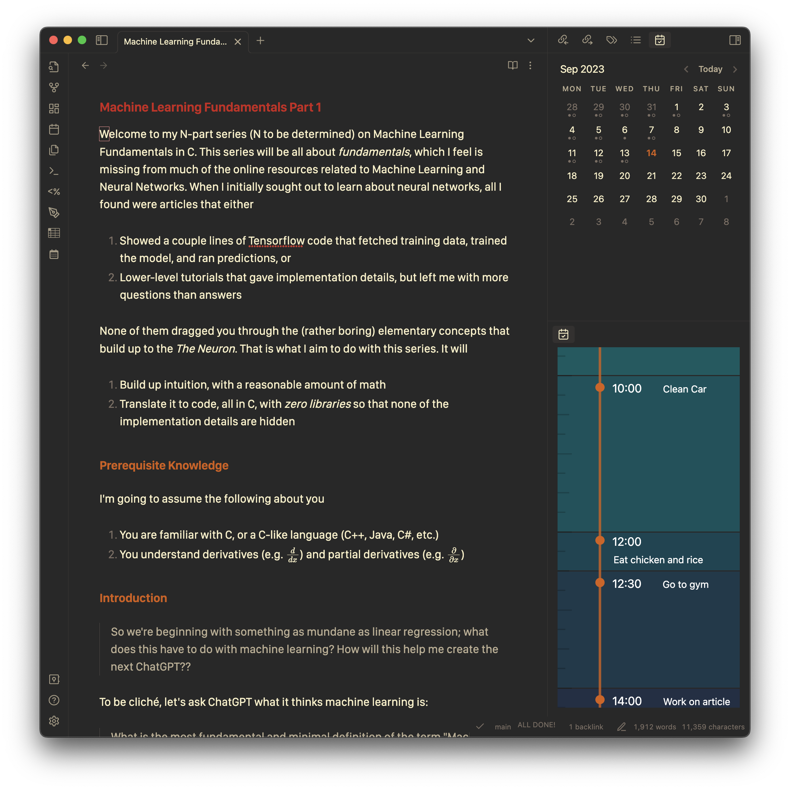
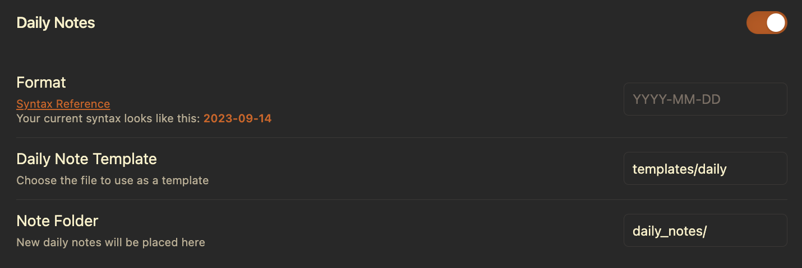
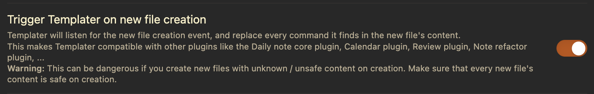
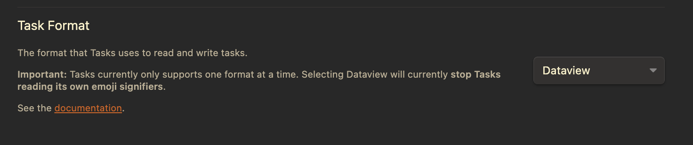
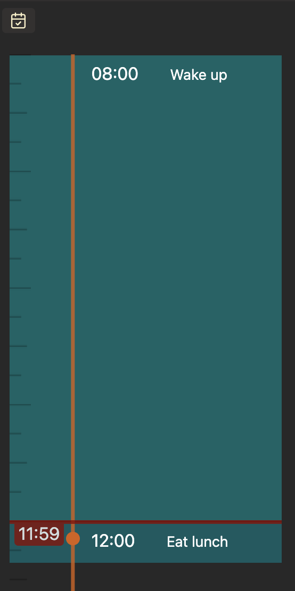
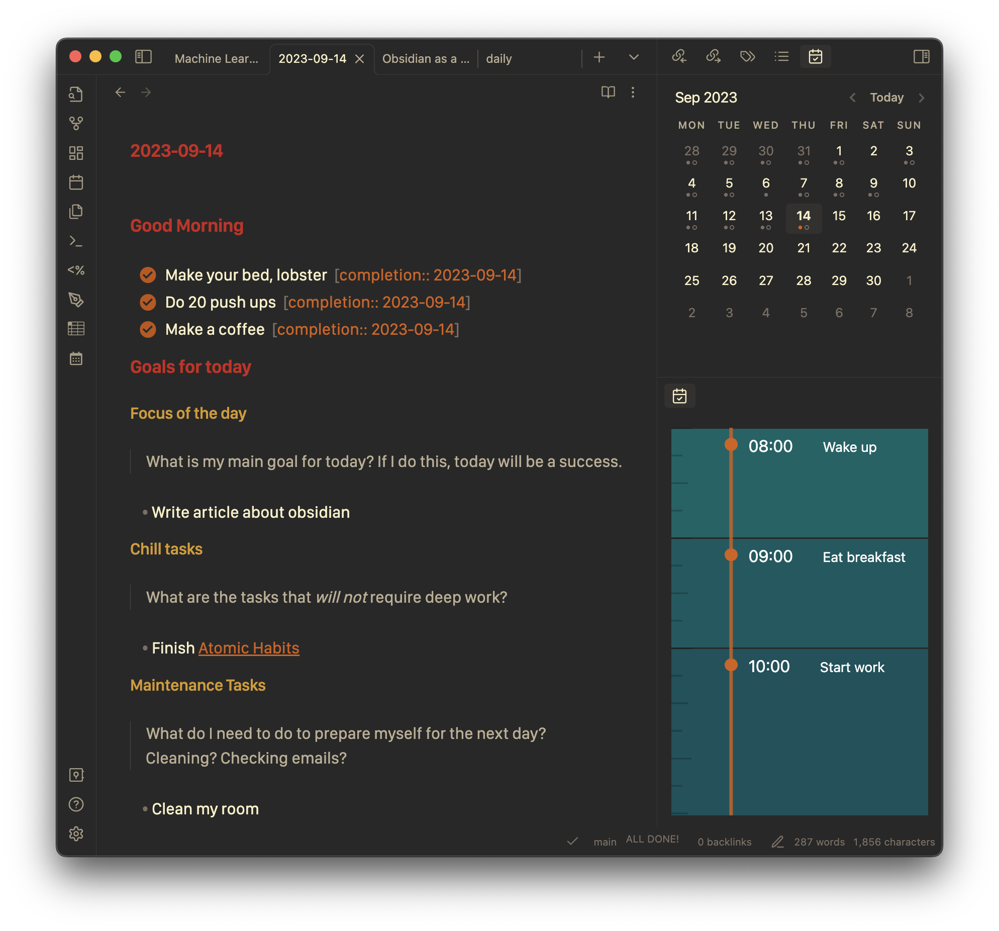
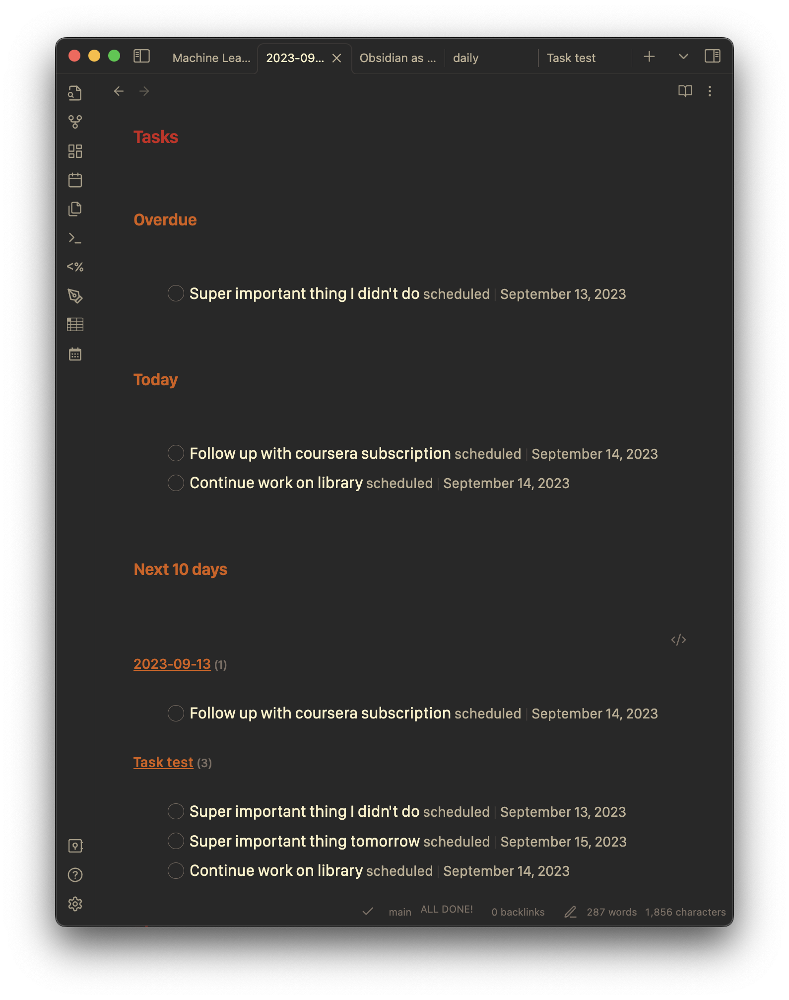
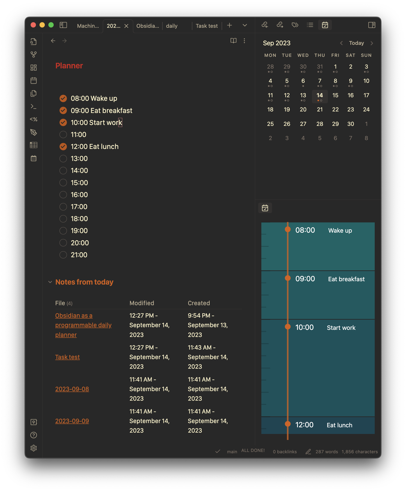
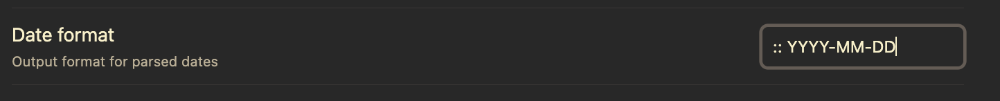

One of the most striking elements of Silicon Valley to outsiders is *productivity culture*. Whereas most people in most places live in complete satisfaction doing their job as they would, SV people won't find peace without optimizing their every habit and system to extract that extra iota of productivity per unit time. I am one of those people, and this article is about how I revolutionized my productivity switching from Neovim orgmode to Obsidian.

I will try to motivate my switch though so that I don't sound totally crazy. If you want to get straight to my setup, click [here](./#obsidian).

## Org-mode, but in Neovim

I had been using the `nvim-orgmode` plugin for the past year to organize my schoolwork, general TODOs, and notes in one repo, backed up to both iCloud and periodically to GitHub.

```tree
├── Archive
│   ├── Fall2021
│   ├── Fall2022
│   ├── Fall2022.org
│   ├── Spring2022
│   ├── Spring2023
│   ├── Summer2022
│   ├── Winter2022
│   ├── Winter2023
│   └── Winter2023.org
├── CSE101
│   └── ...
├── CSE141
│   └── ...
├── CSE141L
│   └── ...
├── PHYS2D
│   └── ...
├── books.org
├── inbox.org
├── misc
│   └── ...
├── notes
│   └── ...
├── personal.org
├── projects.org
└── school.org
```

> The file structure of /org. The relevant notes, materials, and TODO files for each class were kept under a seperate directory. `inbox.org` stored general TODOs

On top of this, I used the beorg app on my iPhone, which pulled its data from the same folder through iCloud. This worked quite well: All of my data was in one place, stored in plaintext, and could be accessed from both mobile and desktop. And if you're a Vim addict like me, the idea of never leaving your terminal is very attractive.

### Problems with never leaving Vim

The fundamental reason I chose to leave org-mode was simply because `org` is a crappy file format compared to markdown, at least for prose. It's symbol-laden syntax simply cannot match the simplicity and readability of markdown. It also doesn't have the same tooling support as markdown, which is ubiquitous across the internet. So, I found myself not using `org`  files for notes at all, leaving the **notes and tasks in one place** proposition nulled. 

Then, I had to deck out my vim config with tools that would make markdown editing friendlier. `vim-pencil` auto wrapped lines to give Vim the Google Docs feel. Then, I wrote `pandoc.nvim` to automatically render markdown files to PDF on write.  I also had to write `imagepaste.nvim`  so that I could `cmd-V` images into markdown files. Finally, I had a working setup. However, vim-pencil was buggy, and having a PDF viewer open just to view markdown was annoying.

Deep in my infatuation with Vim, it took a while to realize that though Vim excelled at editing code, it was not built for anything *prose-like*. This includes notes. Its slogan of **editing at the speed of thought** did not seem to apply for notes.

That's when I found Obsidian. With a few plugins, it became fully programmable like Vim, and also happened to be *built* for note taking.

## Obsidian

Here's an overview of my current configuration, after 1 month of deliberate usage. I tried to keep it speedy, and as manageable as possible. 

### Theme

I'm using the Minimal theme, which comes with multiple color schemes you can choose from the Minimal Theme Settings plugin.

I'm using the Gruvbox color scheme.



### Plugins

Much of my setup revolves around my daily note, which I use as a sort of homepage that contains my goals, TODOs, and schedule.

You can find any of these by searching its name in Obsidian settings $\to$ Community plugins $\to$ Browse.

#### Periodic Notes

This simply gives you a command to open the daily note, and applies a template to that note when its created. I have it setup like this



This means it will copy and execute  `templates/daily.md` into `daily_notes/YYYY-MM-DD.md`, formatted with today's date.

#### Templater

This is the real juice of my setup. It let's you execute almost arbitrary Javascript code and insert the result into the daily notes file.

Make sure this setting is on



#### Tasks

This is the replacement for org-mode's TODO feature. Set it up like so in order to be compatible with Dataview.



#### Dataview

One of the most popular and useful plugins in Obsidian, it converts your Vault into a database which you can query. I mainly use it for tasks, but there are a plethora of uses you can find in its documentation.

#### Calendar

This is just for convenience, but it inserts this neat calendar in the side bar. You can click on any of the days and it will take you to its daily note.

#### Day Planner

This looks at the current note for markdown such as 

```markdown
- [ ] 08:00 Wake up
- [ ] 12:00 Eat Lunch
```


And displays a calendar on the sidebar like so




### My Daily Note Template


~~~markdown

# Good Morning

<!--- 
I have a todo list of things I do everyday to wake
up feeling accomplished
-->

- [ ] Make your bed, lobster
- [ ] Do 20 push ups
- [ ] Make a coffee


# Goals for today

<!---
Using the 3-3-3 Method, which works well for me
-->

### Focus of the day

> What is my main goal for today? If I do this, today will be a success.

- 
### Chill tasks 

> What are the tasks that *will not* require deep work?

- 
### Maintenance Tasks

> What do I need to do to prepare myself for the next day? Cleaning? Checking emails?

- 

# Tasks

<!---
Code that stores today and tomorrow in  YYYY-MM-DD
format for the queries below.
-->


## Overdue

<!---
Run a query over all tasks where its deadline/scheduled
date passed.
-->

```dataview
TASK WHERE
!completed AND ((due AND due < date("Obsidian as a programmable daily planner copy")) OR (scheduled AND scheduled < date("Obsidian as a programmable daily planner copy")))
SORT min(due, scheduled) ASC
```

## Today

<!---
Run a query over all tasks where its deadline/scheduled
date is today.
-->

```dataview
TASK
WHERE scheduled = date("Obsidian as a programmable daily planner copy") OR due = date("Obsidian as a programmable daily planner copy")
```

## Next 10 days

<!---
Run a query over all tasks where its deadline/scheduled
date is in the next 10 days.
-->

```dataviewjs
dv.taskList(
  dv.pages().file.tasks.where((t) => {
    // tasks where !completed
    // due or scheduled within N days
    const N = 10;
    if (t.completed) {
      return false;
    }

    if (!t.due && !t.scheduled) {
      return false;
    }
    let relDate;
    if (!t.due || !t.scheduled) {
      relDate = t.due || t.scheduled;
    } else {
      relDate = t.due < t.scheduled ? t.due : t.scheduled;
    }

    const diff = relDate - (new Date("Obsidian as a programmable daily planner copy"));
    const dayDiff = diff / (1000 * 60 * 60 * 24);
    return dayDiff <= N;
  }),
);
```
# Planner


<!---
Times for day planner so that I don't have to type them
every day.
--->

- [ ] 08:00
- [ ] 09:00
- [ ] 10:00
- [ ] 11:00
- [ ] 12:00
- [ ] 13:00
- [ ] 14:00
- [ ] 15:00
- [ ] 16:00
- [ ] 17:00
- [ ] 18:00
- [ ] 19:00
- [ ] 20:00
- [ ] 21:00

## Notes from today

<!---
A query over all files that selects which notes
where modified today. This lets me go back to the
notes I was working on easily.
-->

```dataview
TABLE file.mtime as "Modified", file.ctime as "Created"
WHERE file.mtime > date("Obsidian as a programmable daily planner copy") AND file.mtime < date("Invalid date") AND file.day != date("Obsidian as a programmable daily planner copy")
SORT file.mtime DESC
```
~~~

### Gallery






### Other nice plugins

#### Excalidraw

If you're not familar with this drawing tool, you should be. It's a great way to make diagrams and sketches. As a bonus, it has full integration into obsidian through the Excalidraw plugin!

Note: you need another plugin called `Ozan's Image in Editor Plugin` to view the drawings in other notes.

#### Advanced tables

One of the least nice parts about markdown is its table syntax. This makes it more nice to deal with with auto formatting and even spreadsheet formulas.

#### Paste url into selection

Highlight text, and `cmd-V`. The text is now a link to what was in your clipboard!

#### Natural language dates

I use this with tasks.

What I type:

```markdown
- [ ] A task [scheduled @today]
```

What I get:

```markdown
- [ ] A task [scheduled :: 2023-09-14]
```

I use this setting to get the `::`



#### Obsidian Git

This automatically backs up my vault to a Git repository. Replicating the behavior of my orgmode setup, but better!

#### Vimrc Support

Since I use the vim keybindings on Obsidian, this lets me customize it (to a degree) with a custom `.vimrc` file.

## Conclusion

Overall, I am enjoying using Obsidian. And, I have seen no productivity hit from leaving my terminal for some tasks. Sounds crazy, but it's true. If you want to get started with Obsidian, I would suggest staying away from YouTube videos related to Obsidian based note-taking systems. I've found that they're more of a distraction than an aid. Just write notes the way you usually do, and gradually include obsidian features as time passes.

If you have any thoughts, comments, or tips related to Obsidian or this article, feel free to leave them below!
