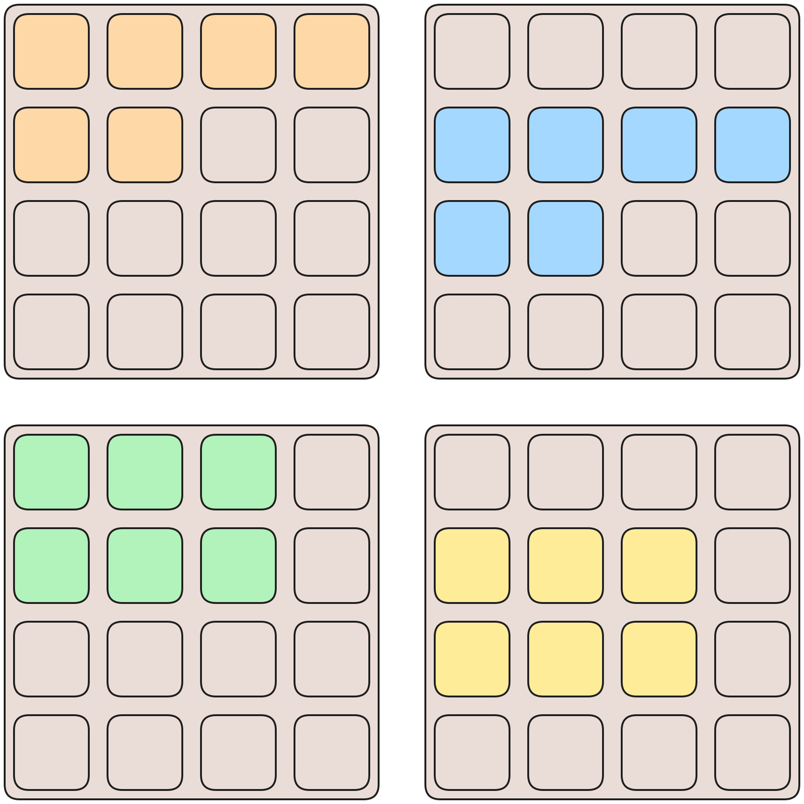
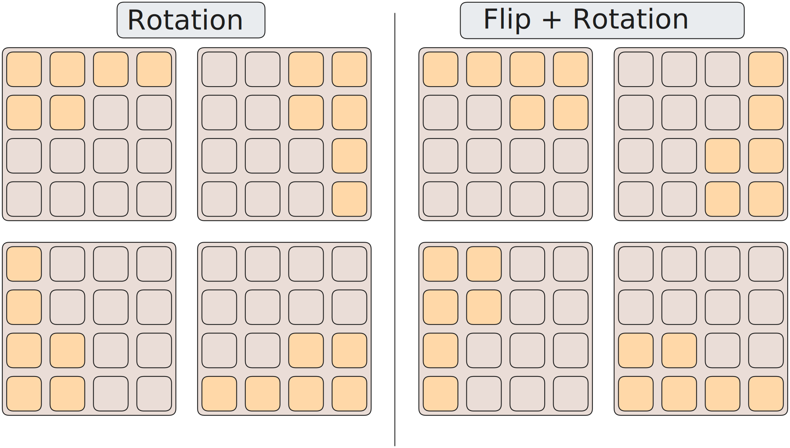



If you've been on the internet during the 2010's, you're probably familiar
with the addictive game, **2048**. Let's see how high we can
score with the power of machine learning.

## Game mechanics

The game works as follows. The board begins with 2 random tiles.
Each random tile has a 90% chance of being `2` and a 10% chance
of being `4`. 

There are 4 possible moves: Up, Down, Left, and Right. Each move corresponds
to a "sliding" motion on the board, where all tiles are shifted in that direction
until it collides with another tile. If two tiles have the same value $N$, the tiles
merge into a higher tile with value $2N$. Every time we merge, our score increases
by $2N$.

## Is it even that hard?

*Yes, it is*. At least to get an arbitrarily high tile. To see why, let's say you have
achieved 1024. Then, you have used 16 squares as a "scratchpad" to produce that score.
To get 2048, however, you have to produce *another* 1024 with $16-1=15$ squares as
the scratchpad. To get 4096, you need to do it with 14 tiles, and so forth. So there is
in fact a 
[theoretical maximum score of 3,932,156](https://www.reddit.com/r/2048/comments/214njx/highest_possible_score_for_2048_warning_math/),
that can be calculated solely from space constraints. We won't be getting there today, but
we will try to beat the best humans.

## Methods

There are two classes of methods that we will be using: search based and
learning based. Search-based methods try to explore a multitude of possible
game states and make a guess based on which move *most likely* will result
a desired outcome. Learning-based methods define a player model and simulate a
large number of games to learn its parameters.

### Random Player

This is our baseline. It is quite bad.

### Monte Carlo

This method works as follows:

- We have a **main** board, where we only play optimal moves
- For each possible move $m$, make a copy of the board, and on that make the move $m$
- Then, let a random player make moves on that board
until it loses. Then, we save the sum of the tiles of the final board. This will be
our **score**.
- Repeat that $N$ times, where a higher $N$ would mean more games were explored.
- Choose the move with the highest average score as the optimal move.

Here is the pseudocode:

```python
def choose_best_move(board):
    scores = [] # List of average sum of tiles
    moves = [UP, DOWN, LEFT, RIGHT]
    for move in moves:
        # Make a copy of the board
        board_copy = copy(board)
        # Make move (includes tile spawn)
        board_copy.make_move(move)
        tile_sums = []
        # Given this move, we let a random player
        # play until the game is over. Then, we record
        # the average sum of the final tiles on the board.
        for n in range(num_games):
            board_copy2 = copy(board_copy)
            # Have a random agent play until it loses
            board_copy2.random_game()
            sums.append(board_copy2.tile_sum())
        # Save the average sum of tiles in the losing configuration
        scores.append(sum(tile_sums) / len(tile_sums))
    return moves[argmax(scores)]
```

### N-Tuple Network

N-Tuple networks, originally conceived of as [RAMnets](https://en.wikipedia.org/wiki/RAMnets),
have been discovered to be extremely good at playing 2048 when trained using temporal 
difference learning. They effectively define a function $F$ that maps some kind of feature, 
encoded in binary, to a score which represents how *good* that specific feature is.

This function, unlike most modern neural nets, is not computed but stored in an array, each of
whose elements represent the *score* of the feature that corresponds to its index.

To understand how we will index into the array, let's look at the implementation
of the game board.

#### Board Implementation

```rust
struct Board {
    raw: u64,
}
```

That's right, we fit the whole thing into a 64 bit unsigned integer. We do this by observing that

1. Each tile value is either empty, or $2^n$ where $n \ge 1$
2. From experience, we probably will not get the $2^{16}=65536$ tile.

This results in the bound $1 \le n \le 15$. Thus, we have $15+1$ possible values
for each tile, meaning we can pack it into $4$ bits. To get the tile value back we use

$$
\text{actualvalue}(n) =
\begin{cases}
\text{empty} &\text{ if } n = 0 \\\\
2^n &\text{ otherwise} 
\end{cases}
$$

#### Architecture

The network we use is a $4 \times 6$ tuple net, which has 4 features, with each feature
representing a configuration of $6$ tiles on the board. Since each tile takes up $4$ bits,
each feature will use $6 \times 4 = 24$ bits.



Since our network is a map from feature $\to$ score, we use an array
of $2^{4 \times 6} = \text{16,777,216}$ 32-bit floats to store each feature.
Since each float is 4 bytes, this brings our network size up to $4 \times 4 \times \text{16,777,216} = \text{268,435,456}$ bytes.

One handy observation we can make is that the value of the feature should not change
depending on its location on the board. For example, a row with the tiles 
$(512,1024,2048,4096)$ is equally good whether it's on the top, bottom, left, 
or right of the board. In fact, even if we reverse it's order, it's just as good. This means
we can reuse the same weights to calculate the score of the feature on all 
orientations, or symmetries, of the board. A square has 
[8 such symmetries](https://groupprops.subwiki.org/wiki/Dihedral_group:D8), which we show below.


