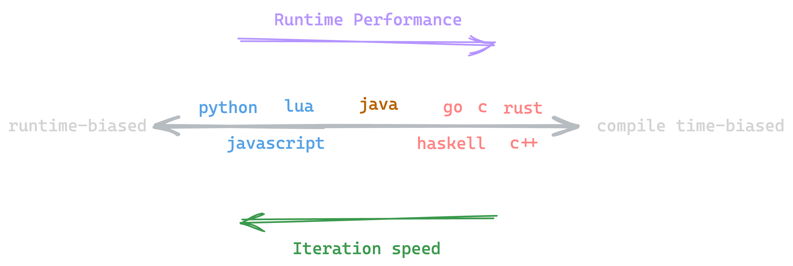

Programming is all about state.

Computer Scientists will tell you that programming languages are just one way of
defining the DFA (or state machine) of an abstract Turing Machine. On the other
hand, hardware engineers will tell you the CPU, the physical object that runs
the program, is *literally* a state machine encoded with transistors.

Programming is all about state.

One could argue that, ignoring syntax, what differentiates one programming
language from another is how it handles state. One way we can classify how
languages handle state is by considering how much of it is resolved at
compile-time vs. run-time.



On the very left are fully interpreted languages [^1], such as Python and Lua,
who don't even know what instructions to execute until runtime. On the other
side, we have strongly-typed, compiled languages like Rust and C++, who require
extensive information about the program before it can be compiled.

There are tradeoffs, no matter where the language is on the spectrum. Very
strict languages, which require extensive information about types, memory, and
lifetimes are often difficult to build and iterate with, but are very efficient
at runtime. But languages on the other side are the opposite: easy to quickly
write something up with, but coming with a significant runtime cost.

There is one area where the strongly typed languages unambiguously shine: error
management. More often than not, the philosophy of interpreted languages is to
debug *after* running to see if any unexpected exceptions are thrown.

> *Algorithm Y: Interpreted Language Debugging (simplified)*
>
> 1. Write code
> 1. Run code
> 1. **if** there is no error, go to step 6
> 1. deal with error
> 1. go to step 2
> 1. Deploy

Whether you value development time over runtime performance, or vice versa, I
think we can all agree that programs should be **correct** and **robust** to
errors.

We're going to look at a *Design Pattern* that helps categorize and shift
*runtime* logic into *compile time* (or *code-writing-time*, if using an
interpreted language) information. Effectively, it will create a state pipeline
that leverages the language's type system to prevent illegal object states. And
don't worry, static typing isn't necessary.

Let's take a look at an example of a refactor that uses this pattern.

## The Task

Boss tells us that it's imperative we write a library that counts the number of
occurrences of a given character in **any file** pointed at by **any url**. He
also wants the file to be downloaded at **any time** by the user of our code.

Sounds good. Let's make a class which does exactly that

```python
class FileDownloadCharCounter:
    def __init__(self, url):
		# Save arg as instance variable
        self.url = url

    def download(self):
		# Download content and save for later use
        self.downloaded_content = requests.get(self.url).text

    def create_index(self):
		# Create a dictionary that stores char counts
        self.index = {}
        for char in self.downloaded_content:
            self.index[char] = self.index.get(char, 0) + 1

    def get_count(self, target_char):
		# Get count from dictionary
        return self.index.get(target_char, 0)
```

For this exercise, let's assume `requests.get` will never fail. Let's test the
class

```python
counter = FileDownloadCharCounter(
	"https://world.hey.com/dhh/programming-types-and-mindsets-5b8490bc"
)
counter.download()
counter.create_index()
target = "a"
n = counter.get_count("a")
print(f"{target} appears {n} times")
```

```bash
a appears 477 times
```

Great! Time to deploy? Not so fast... If you look closely, there are quite a few
uncaught exceptions that we have introduced. What happens if the user does this?

```python
counter = FileDownloadCharCounter(
	"https://world.hey.com/dhh/programming-types-and-mindsets-5b8490bc"
)
counter.download()
target = "a"
n = counter.get_count("a")
```

```bash
AttributeError: 'FileDownloadCharCounter' object has no attribute 'index'
```

Uh oh. If the user forgets to create the index, they get an `AttributeError`,
which isn't very helpful. It would require them to read the library source code
to find what went wrong, which is not a great user experience. Let's create a
self-explanatory exception that the user will be able to catch, and resolve:

```python
class IndexNotCreatedException(Exception):
	pass
	
class FileDownloadCharCounter:
    def __init__(self, url):
		# other code ...
        self.index = {}

	# other methods ...
	
    def get_count(self, target_char):
        if len(self.index) == 0:
            raise IndexNotCreatedException
        return self.index[target_char]
```

Now we get a nice

```bash
File "example.py", line 31, in get_count
    raise IndexNotCreatedException
__main__.IndexNotCreatedException
```

that we can handle with

```python
try:
	count = counter.get_count('a')
except IndexNotCreatedException:
	# recover
	pass
```

Is there another way it can break? Yes:

```python
counter.create_index()
target = "a"
n = counter.get_count("a")
```

```bash
  File "example.py", line 13, in create_index
    for char in self.downloaded_content:
AttributeError: 'FileDownloadCharCounter' object has no attribute 'downloaded_content'
```

If the library user forgets to download the file, it throws another
`AttributeError`, which isn't very helpful. Let's handle that

```python
class FileNotDownloadedException(Exception):
    pass

class FileDownloadCharCounter:
    def __init__(self, url):
		# ...
        self.downloaded = False

    def download(self):
		# ...
        self.downloaded = True

    def create_index(self):
        if not self.downloaded:
            raise FileNotDownloadedException
		# ...
```

Now, the user can handle this exception as we did above. There's still another
bug; can you find it? Let's say the user accidentally does this

```python
counter = FileDownloadCharCounter(
	"https://world.hey.com/dhh/programming-types-and-mindsets-5b8490bc"
)
counter.download()
counter.create_index()
# other important stuff...
counter.create_index()
# more important stuff...
target = "a"
n = counter.get_count("a")
print(f"{target} appears {n} times")
```

Now we get *double* the actual count!

```
a appears 954 times
```

*And* **no exception**. That means this bug wasn't caught by Algorithm Y. Again,
let's handle this

```python
class IndexNotCreatedException(Exception):
    pass


class FileDownloadCharCounter:
	# methods...

    def create_index(self):
        if len(self.index) > 0:
            raise IndexAlreadyCreatedException
		# more code...
```

Phew! That seems to be all the state-related errors. This is our final code:

```python
class IndexNotCreatedException(Exception):
    pass

class IndexAlreadyCreatedException(Exception):
    pass

class FileNotDownloadedException(Exception):
    pass


class FileDownloadCharCounter:
    def __init__(self, url):
        self.url = url
        self.index = {}
        self.downloaded = False

    def download(self):
        self.downloaded_content = requests.get(self.url).text
        self.downloaded = True

    def create_index(self):
        if not self.downloaded:
            raise FileNotDownloadedException

        if len(self.index) == 0:
            raise IndexAlreadyCreatedException

        for char in self.downloaded_content:
            self.index[char] = self.index.get(char, 0) + 1

    def get_count(self, target_char):
        if len(self.index) == 0:
            raise IndexNotCreatedException

        return self.index.get(target_char, 0)
```

Et voilà! Our object oriented code is... **terrible**. For what should be just a
few simple lines of Python, we have 3 custom exceptions and a bunch of logic
that just makes sure nothing went wrong.

And you can imagine that if, instead of 3 instance variables that tracked state,
we had 30, it might not even be possible to know or enumerate all the illegal
states to throw exceptions for.

Unfortunately, a lot of the interpreted languages tend to make writing robust
code tedious. To help deal with this, let's introduce a new design pattern,
which I will refer to as the **Type Pipeline**, or **Typeline** if you wish.

## Existence $\\implies$ State

With this trick, in statically-typed languages, code with illegal state won't
compile. In dynamically typed ones, if you don't get a `TypeError`, you'll have
a guaranteed legal state.

This is how it works:

- Associate a type $T$ with a state $Y$
- Guarantee that the existence of an instance object $t$ of $T$ implies we are
  in state $Y$

It's that simple. Let's now try to refactor our code from before. Consider the
valid states of our program

| State | URL known     | File Downloaded | File Indexed  |
| ----- | ------------- | --------------- | ------------- |
| 1     | $\\checkmark$ |                 |               |
| 2     | $\\checkmark$ | $\\checkmark$   |               |
| 3     | $\\checkmark$ | $\\checkmark$   | $\\checkmark$ |

It's clear that this is a simple linear pipeline. State 1 requires a URL as
input, State 2 requires State 1, and State 3 requires State 2.

If $T_n$ is the type corresponding to State $N$, constructing an instance of
$T_n$ should only be accessible through an instance of $T\_{n-1}$. Let's start
with State 1, which just requires a valid URL.

```python
class FileURL: # i.e. T_1
	def __init__(self, url):
		# optionally validate url
		self.url = url
```

Since we only want $T_2$ to be constructed from an instance of $T_1$, let's add
a method on $T_1$ that constructs a $T_2$ with valid state (the file has been
downloaded)

```python
class FileURL:
	# other methods ...
	def download_file(self, file_url: FileURL) -> DownloadedFile:
		file_contents = requests.get(file_url).text
		return DownloadedFile(file_contents)

class DownloadedFile:
	def __init__(self, file_contents: str):
		self.contents = file_contents
```

And we repeat for $T_3$, which represents an indexed file

```python
class DownloadedFile:
	# other methods ...
	def index_file(self) -> IndexedFile:
		index = {}
		for char in content:
            index[char] = index.get(char, 0) + 1
		return IndexedFile(index)
		
class IndexedFile:
	def __init__(self, index: dict[str, int]):
		self.index = index

	def get_count(self, target_char):
		return self.index.get(target_char, 0)
```

Now, all these classes are just for demonstrating the idea. In reality we don't
really need to give the user access to a downloaded-but-not-indexed file nor a
URL class which just wraps a string. They just need to be able to download the
file on demand and get char counts.

So, we can remove the types associated with those states and stuff the logic in
a transition method or a constructor.

```python
class FileURL:
	def __init__(self, url):
		self.url = url

	# State 1 -> 3
	def fetch_index(self) -> CharIndex:
		# State 1 -> 2
		content = requests.get(url).text
		# State 2 -> 3
		return CharIndex(content)

class CharIndex:
	# State 2 -> 3
	def __init__(self, content: str):
		index = {}
		for char in content:
            index[char] = index.get(char, 0) + 1
		self.index = index

	def get_count(self, target_char):
		return self.index.get(target_char, 0)
```

Usage:

```python
file = FileURL("https://world.hey.com/dhh/programming-types-and-mindsets-5b8490bc")
index = file.fetch_index()
count = index.get_count('a')
```

You can see how illegal state is no longer an issue with transition/construction
guarantees.

However, there are some caveats. This pattern will only work as long as

1. States are known at compile/code-writing time (i.e. the object at line $n$
   *should* have state $X$)
1. There are only a handful of such states, since you *may* have to create a new
   class for each one

## Some Benefits

In garbage collected languages, a huge benefit is memory efficiency. Going back
to our example, in the original class, the downloaded file has the same
*lifetime* of the whole object. This means, as long as there exists some
reference to the object, the string of the whole site is stored in memory.

```python
counter = FileDownloadCharCounter(...)
counter.download_file()  # space for string allocated
counter.create_index()   # index dict allocated
counter.get_count('a')

# Everything freed at end of scope
```

But we know from the task that after the index is created, we no longer need the
file contents. The because the Typeline is built around data transformation,
lifetimes are explicitly defined. If a piece of data is no longer needed, it can
be safely destroyed by the GC.

```python
file = FileURL(...)
index = file.fetch_index() # string allocated and immediately freed
count = index.get_count('a') # index allocated
# Index freed at end of scope
```

This is especially useful if the file we downloaded was several GB, or we were
concurrently scraping thousands of websites.

## Conclusion

This article describes a simple design pattern that I found useful when writing
`streamrip` v2, which fixed an extremely large number of possible state errors
in v1, and significantly simplified the codebase. Although I haven't come across
this exact idea before, it is by no means original. The Typeline is just an
Object-Oriented way of encoding a DFA with some side effect management. So all
the theoretical work that has been done on DFAs are equally applicable here.

Let me know if you've spotted this pattern anywhere!

[^1]: Modern languages we call interpreted are actually compiled with JIT (or
    just-in-time) compilation. We use the term "interpreted" to mean that a
    incorrectly typed program can still be run.
